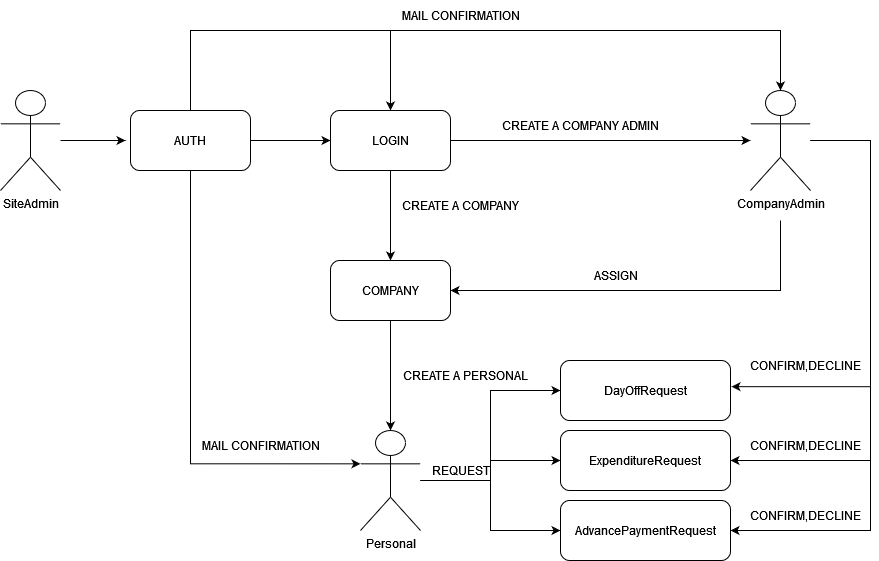

# Human Resources Information System (HRIS)

This project is a backend application called the Human Resources Information System (HRIS) developed as part of a course completion project. The HRIS aims to provide a comprehensive system for managing HR-related tasks within organizations. The application is built using a layered architecture, ensuring scalability and modularity.

## Features

The HRIS supports three different roles within the system:

1. Site Administrator:
   - Add companies to the database.
   - Assign managers to the companies.
   
2. Company Manager:
   - Add employees to the company.
   - Approve or reject employee requests.
   
3. Company Personnel:
   - Make requests such as permission, advance payments, and allowances.

## Technologies Used

The HRIS project utilizes the following technologies:

- RabbitMQ: Asynchronous message broker for inter-service communication.
- PostgreSQL: Relational database for storing structured data.
- MongoDB: NoSQL document database for storing unstructured or semi-structured data.
- DATA-JPA: Spring Data module for simplified database access.
- Redis: In-memory data store for caching and pub/sub messaging.
- ElasticSearch: Scalable search engine for full-text search and analysis.
- Spring Security: Framework for authentication and authorization.
- Spring MailSender: Module for sending email notifications.
- OpenFeign: Declarative web service client for external API integration.
- ConfigServer (Git-Hub): Centralized configuration management using Git repository.
- apiGateway: Entry point for API requests with routing, load balancing, and security features.
- CircuitBreaker: Design pattern for handling network failures and ensuring fault tolerance.
- Zipkin: Distributed tracing system for monitoring and debugging.
- Lombok: Library for reducing boilerplate code in Java.
- MapStruct: Code generation tool for mapping between Java bean types.
- Swagger: Framework for designing, building, documenting, and consuming RESTful APIs.
- JWT-Auth: Authentication mechanism using JSON Web Tokens.

## Installation and Setup

To set up the HRIS project locally, follow these steps:

1. Clone the repository: `git clone <repository-url>`
2. Install the required dependencies: `<dependency-manager> install`
3. Configure the application properties, including database connections and API keys.
4. Build and run the project: `<build-command>`

## Flowchart

 

The flowchart above illustrates the high-level process flow within the HRIS system.

## Database Diagram

  

The database diagram provides an overview of the HRIS database structure, including the relationships between different entities and their attributes.
## Kubernetes Diagram

  

The HRIS project utilizes a Kubernetes system for deployment and scalability, while the database diagram provides an overview of the HRIS database structure, including the relationships between different entities and their attributes.

## Documentation

For detailed documentation of the HRIS project, refer to the following:

- API Documentation: Accessible via the Swagger UI at `<base-url>/swagger-ui.html`
- Code Structure: Refer to the project's source code for detailed information on the architecture and implementation.

## Contributing

Contributions to the HRIS project are welcome! If you find any bugs or want to suggest new features, please open an issue in the project's issue tracker. If you would like to contribute code, feel free to submit a pull request following the contribution guidelines outlined in the repository.

